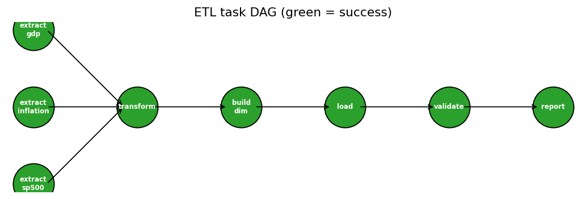

# 03 · Python ETL Pipeline — Macro-Financial Data Mart

End-to-end ETL: three real public sources (World Bank GDP, World Bank CPI inflation, Shiller S&P 500) → cached extracts → typed transforms → SQLite star schema → validation gate → auto-generated run report with cross-source analysis.



## What it demonstrates
- **Explicit task DAG** with dependencies, per-task timing, failure propagation and downstream skipping — a ~40-line runner written deliberately instead of Airflow, so the orchestration concepts are visible rather than hidden behind infrastructure. The graph maps 1:1 to Airflow/Dagster tasks or dbt models.
- **Idempotent, cached extraction** — sources are cached to `data/cache/` with SHA-256 lineage hashes recorded in every run report; delete the cache to force refresh.
- **Dimensional load** — `dim_country` + three fact tables with primary keys, FK references, CHECK constraints, and indices; World Bank aggregates (World, Euro area…) are flagged rather than silently mixed with countries.
- **Validation as a gate, not a log line** — referential integrity, ranges, dedup, sanity checks; any failure raises and the run exits non-zero.
- **Cross-source payoff** — the report joins US inflation (source 2) to S&P annual returns (source 3), reproducing the inflation-regime finding from Project 02 through a completely independent source: same-year corr ≈ −0.2 (see `reports/etl_run_report.md` for the exact run value).

## How to run
```bash
python run_etl.py     # extract (cached) → transform → load → validate → report
```
Outputs: `warehouse/macro_mart.db`, `reports/etl_run_report.md`, `figures/*.png`, task status table on stdout.

## Key assumptions (full transform-level detail in code comments)
1. World Bank GDP values are nominal USD; no deflation is applied in the warehouse — real analysis is a consumer's decision, so both CPI and nominal facts are provided.
2. Hyperinflation observations (Venezuela, Zimbabwe) are **kept** — extreme ≠ erroneous; reporting uses medians/log scales.
3. Recent S&P months carry `0.0` placeholders for fundamentals in the source; converted to NULL at transform, never at load (raw cache remains bit-exact).
4. Country identity is `country_code` (ISO-3166-alpha-3-like); names are display attributes.

## Structure
```
03-python-pipeline/
├── etl/core.py        # extract / transform / load / validate (pure functions)
├── run_etl.py         # DAG runner + report + DAG rendering
├── data/cache/        # cached raw extracts (lineage-hashed)
├── warehouse/         # macro_mart.db (SQLite)
├── figures/           # DAG + analytical figures
└── reports/etl_run_report.md
```
